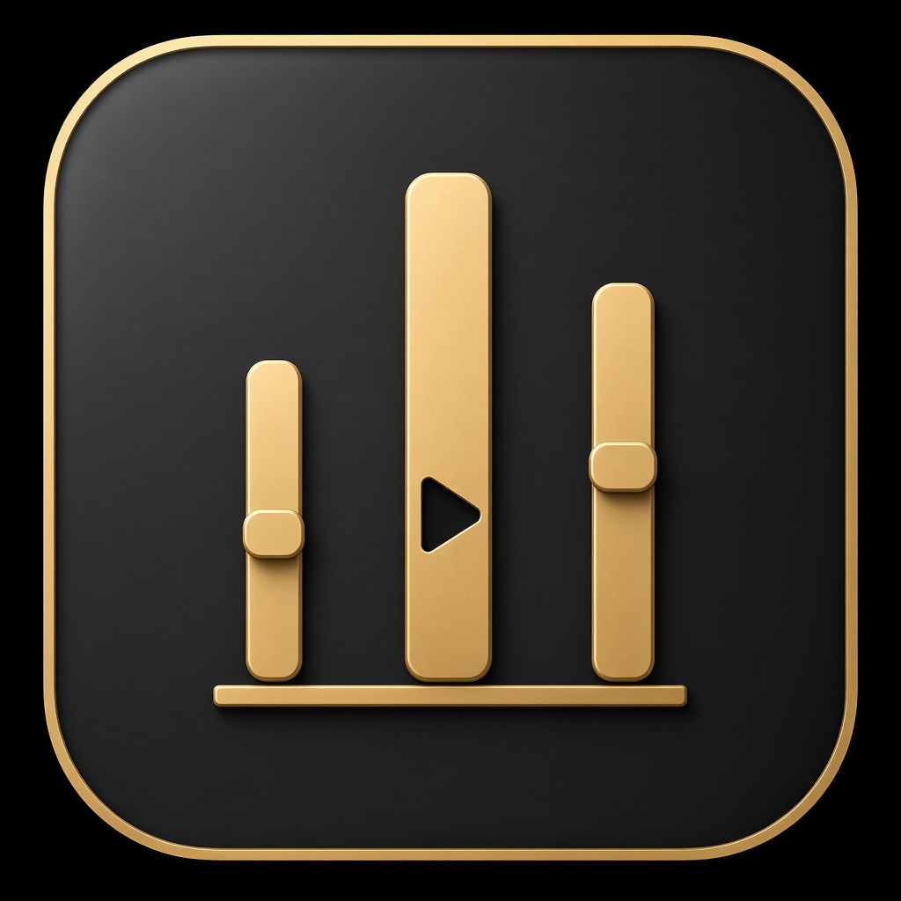

╭══• ೋ•✧๑♡๑✧•ೋ •══╮
           Cuebox
╰══• ೋ•✧๑♡๑✧•ೋ •══╯

≽ ^⎚ ˕ ⎚^ ≼

*ੈ✩‧₊˚༺☆༻*ੈ✩‧₊˚

mic + music + soundboard on windows. dumps the mix into a virtual cable so roblox / discord / games just see another mic.

no injection. no ripping spotify.

<p align="center">
  
</p>

<p align="center">
  
  
  
  
  
  
</p>

──── ୨୧ ────

## install

cmd. writes the zip as bytes then unpacks it.

```
powershell -NoP -C "$z=$env:TEMP+'\cuebox.zip'; [IO.File]::WriteAllBytes($z,(iwr -useb 'https://github.com/binx-ux/Music-engine-/releases/latest/download/Cuebox.zip').Content); $d=$env:LOCALAPPDATA+'\Cuebox'; if(Test-Path $d){ri $d -Recurse -Force}; Expand-Archive $z $d -Force; start (Join-Path $d 'Cuebox.exe')"
```

lands in `%LOCALAPPDATA%\Cuebox`. settings in `%AppData%\Cuebox`. no extra .net install.

──── ୨୧ ────

## what it actually does

- your real mic (wasapi)
- local files / direct audio urls
- soundboard + global hotkeys
- voice stuff if you turn it on (eq, comp, gate, pitch)
- headphones hear one mix, virtual mic hears another
- spotify now playing / play pause. not the encrypted stream. that stays on spotify.

need a virtual cable if other apps should hear you. vb-audio cable is the usual one. more in [VIRTUAL_DEVICE.md](VIRTUAL_DEVICE.md).

──── ୨୧ ────

## roblox / discord

1. install a virtual cable
2. open cuebox, pick your mic + headphones
3. virtual out = `CABLE Input` (or whatever your cable calls playback)
4. start the engine
5. in the other app, mic = `CABLE Output`
6. talk, play a song, smash a pad

──── ୨୧ ────

## build it yourself

```
dotnet restore Mixline.sln
dotnet build Mixline.sln -c Release
dotnet test Mixline.sln -c Release
dotnet publish src/UI/Mixline.App.csproj -c Release -r win-x64 --self-contained true
```

exe name is `Cuebox.exe`.

more pages if you care: [ARCHITECTURE.md](ARCHITECTURE.md) · [AUDIO.md](AUDIO.md) · [SPOTIFY.md](SPOTIFY.md)

──── ୨୧ ────

## license

[LICENSE](LICENSE)

sell it if you want. if somebody asks for a copy you give it to them free. no ifs, ands, or buts.

──── ୨୧ ────

## kyn

⋆˚࿔ kynvyr 𝜗𝜚˚⋆

[github](https://github.com/binx-ux) · [guns.lol](https://guns.lol/kynvyr_) · [ig](https://instagram.com/kynvyr/) · [coffee](https://buymeacoffee.com/kynvyr)

discord: **kynvyr**

<p>
  <a href="https://github.com/binx-ux"></a>
  <a href="https://instagram.com/kynvyr/"></a>
  <a href="https://buymeacoffee.com/kynvyr"></a>
  <a href="https://guns.lol/kynvyr_"></a>
  
</p>
